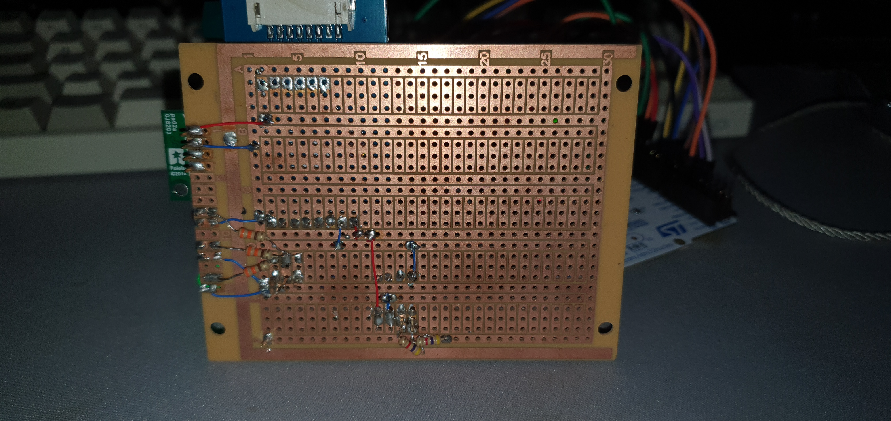

# Temperature, pressure, height meter with STM32l476x

## Introduction
This device allows for displaying basic information about it's height, atmospheric pressure and temperature with functionality to switch units. 
Python modules have been used to communicate with controller via UART.

## Getting Started
Python 3.11.4 64-bit is required to run this project.
Additional python requirements are available in requirements.txt.

## Architecture

Class structure of python packages:


## Demo

To test your device and run visual demo for all available functions use:
```bash
$ python python_interface/example.py
 ```

## Photos

##### Circuit diagram:


##### Device pictures:




#### Display:


